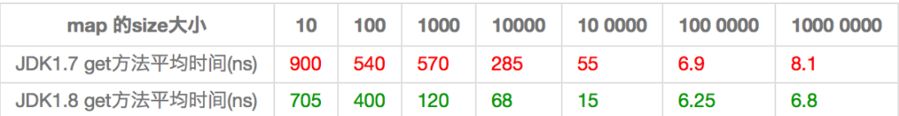
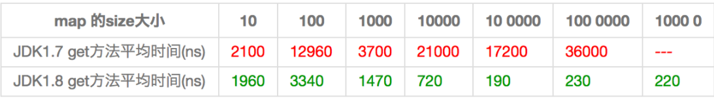

### **一. HashMap的基本变量**

```java
    /**
     * 默认的初始容量为16，必须是2的幂次
     */
    static final int DEFAULT_INITIAL_CAPACITY = 1 << 4; // aka 16

    /**
     * 最大容量即2的30次方
     */
    static final int MAXIMUM_CAPACITY = 1 << 30;

    /**
     * 默认装载因子，已经添加的元素/数组总长度
     */
    static final float DEFAULT_LOAD_FACTOR = 0.75f;

    /**
     * 当put一个元素时，其链表长度达到8时将链表转换为红黑树
     */
    static final int TREEIFY_THRESHOLD = 8;

    /**
     * 链表长度小于6时，解散红黑树
     */
    static final int UNTREEIFY_THRESHOLD = 6;

    /**
     * The smallest table capacity for which bins may be treeified.
     * (Otherwise the table is resized if too many nodes in a bin.)
     * Should be at least 4 * TREEIFY_THRESHOLD to avoid conflicts
     * between resizing and treeification thresholds.
     */
    static final int MIN_TREEIFY_CAPACITY = 64;
```


### 二. HashMap的结构

```java
	/**
	 * HashMap的哈希桶数组，非常重要的存储结构，用于存放表示键值对数据的Node元素。
	 */
	transient Node<K,V>[] table;

    /**
     * HashMap将数据转换成set的另一种存储形式，这个变量主要用于迭代功能
     */
    transient Set<Map.Entry<K,V>> entrySet;

    /**
     * HashMap中实际存在的Node数量，注意这个数量不等于table的长度，甚至可能大于它，因为在	 * table的每个节点上是一个链表（或RBT）结构，可能不止有一个Node元素存在。
     */
    transient int size;

    /**
     * HashMap的数据被修改的次数，这个变量用于迭代过程中的Fail-Fast机制，其存在的意义在于保证      * 发生了线程安全问题时，能及时的发现（操作前备份的count和当前modCount不相等）并抛出异常      * 终止操作。
     */
    transient int modCount;

    /**
     * HashMap的扩容阈值，在HashMap中存储的Node键值对超过这个数量时，自动扩容容量为原来的二      * 倍。
     */
    int threshold;

    /**
     * HashMap的装载因子，可计算出当前table长度下的扩容阈值：threshold = loadFactor *        * table.length。 
     */
    final float loadFactor;
```

```java
	static class Node<K,V> implements Map.Entry<K,V> {
        final int hash;
        final K key;
        V value;
        Node<K,V> next;

        Node(int hash, K key, V value, Node<K,V> next) {
            this.hash = hash;
            this.key = key;
            this.value = value;
            this.next = next;
        }

        public final K getKey()        { return key; }
        public final V getValue()      { return value; }
        public final String toString() { return key + "=" + value; }

        public final int hashCode() {
            return Objects.hashCode(key) ^ Objects.hashCode(value);
        }

        public final V setValue(V newValue) {
            V oldValue = value;
            value = newValue;
            return oldValue;
        }

        public final boolean equals(Object o) {
            if (o == this)
                return true;
            if (o instanceof Map.Entry) {
                Map.Entry<?,?> e = (Map.Entry<?,?>)o;
                if (Objects.equals(key, e.getKey()) &&
                    Objects.equals(value, e.getValue()))
                    return true;
            }
            return false;
        }
    }
```


### 三. **get方法分析**

```java
public V get(Object key) {
    Node<K,V> e;
    return (e = getNode(hash(key), key)) == null ? null : e.value;
}


final Node<K,V> getNode(int hash, Object key) {
    // 搜索标准：根据key搜索节点的方法。记住判断key相等条件：hash值相同并且符合equals方法。
    
    //做初始化
    Node<K,V>[] tab; Node<K,V> first, e; int n; K k;
    
    //表不为null 并且表中有元素并且 hash值对应下标数组中的元素不能为null，为null则无这个key
    if ((tab = table) != null && (n = tab.length) > 0 &&
            (first = tab[(n - 1) & hash]) != null) {
        
        // 传入的hash要和当前的第一个元素是否一致 并且key值要和传入的key相等，说明第一个元素         // 就是要找的元素。
        if (first.hash == hash && // always check first node
                ((k = first.key) == key || (key != null && key.equals(k))))
            // if判断成功，代表当前链表第一个节点就是我们要找的节点，直接返回即可
            return first;
        
        // 如果第一个元素不是，则需要找下面的元素。
        if ((e = first.next) != null) {
            // 当这个table节点上存储的是红黑树结构时
            if (first instanceof TreeNode)
                // 在根节点first上调用getTreeNode方法,内部遍历红黑树节点，查看是否有匹配的                 // TreeNode。
                return ((TreeNode<K,V>)first).getTreeNode(hash, key);
            // 否则证明是链表实现的
            do {
                
                if (e.hash == hash &&
                        ((k = e.key) == key || (key != null && key.equals(k))))
                    return e;
            } while ((e = e.next) != null);
        }
    }
    // 找到最后还没返回证明没有找到
    return null;
}
/**
* 采用树实现的则通过递归方式进行遍历。
*/
final TreeNode<K,V> getTreeNode(int h, Object k) {
        return ((parent != null) ? root() : this).find(h, k, null);
}
```

**总结get流程：**

1. 判断当前hash表中有无这个元素，通过hash值就可以判断。无返回null。
2. 判断当前hash值对应的数组下标的第一个节点的key是否equals要查询的key，如果相等返回。
3. 判断当前的第一个节点是链表的第一个节点还是红黑树的根节点，根据结果去对应的数据结构里找数据返回即可。
4. 最终都没有找到返回null。


### 四. put源码分析

```java
// 基本方法
public V put(K key, V value) {
    //算出key的hash值，
    return putVal(hash(key), key, value, false, true);
}

// 这里onlyIfAbsent表示只有在该key对应原来的value为null时候才插入，也就是说如果value之前 // 存在了，就不会被新put的元素覆盖。
// evict参数用于LinkedHashMap中的尾部操作，这里没有实际意义。
final V putVal(int hash, K key, V value, boolean onlyIfAbsent,
                   boolean evict) {
    // 如果表为空则新建表
    // 定义变量tab是将要操作的Node数组引用，p表示tab上的某Node节点，n为tab的长度，i为tab的     // 下标。
    Node<K,V>[] tab; Node<K,V> p; int n, i;
    
    // 判断当table为null或者tab的长度为0时，即table尚未初始化，此时通过resize()方法得到初始     // 化的table。
    if ((tab = table) == null || (n = tab.length) == 0)
        n = (tab = resize()).length;
    
    // 此处通过（n - 1） & hash 计算出的值作为tab的下标i，并另p表示tab[i]，也就是该链表第一     // 个节点的位置。并判断p是否为null。
    if ((p = tab[i = (n - 1) & hash]) == null)
        // 如果是null，代表tab[i]位置没有任何元素，就创建即可
        tab[i] = newNode(hash, key, value, null);
    else {
       
        // P不为null的情况三种：
        // 1. p为链表节点
        // 2. p为红黑树节点
        // 3. p是链表节点但长度为临界长度TREEIFY_THRESHOLD，再插入任何元素就要变成红黑树了
        
        // 定义e引用即将插入的Node节点，并且下文可以看出 k = p.key。
        Node<K,V> e; K k;
        
        // HashMap中判断key相同的条件是key的hash相同，并且符合equals方法。这里判断了p.key         // 是否和插入的key相等，如果相等，则将p的引用赋给e。
        // 这个判断就是第一种情况的特殊情况
        if (p.hash == hash &&
                ((k = p.key) == key || (key != null && key.equals(k))))
            // 找到对应的hash并且是第一个，将值赋给e
            // 这里为什么要把p赋值给e，而不是直接覆盖原值呢？现在我们只判断了第一                       // 个节点，后面还可能出现key相同，所以需要在最后一并处理。
            
            // 即HashMap中已经存在了key，于是插入操作就不需要了，只要把原来的value覆盖就可             // 以了。
            e = p;
        
        // 如果是红黑树节点
        else if (p instanceof TreeNode)
            // 这里怎么不遍历红黑树看看有没有key相同的节点呢？其实，putTreeVal内部                     // 进行了遍历，存在相同hash时返回被覆盖的TreeNode，否则返回null。
            e = ((HashMap.TreeNode<K,V>)p).putTreeVal(this, tab, hash, key, value);
        // 接下里就是p为链表节点的情形，也就是上述说的另外两类情况：插入后还是链表/插入后转红黑         // 树。另外，上行转型代码也说明了TreeNode是Node的一个子类。
        else {
            // 剩下的是hash相同但是不是第一个node或者hash不相等
            for (int binCount = 0; ; ++binCount) {
                if ((e = p.next) == null) {
                    // 如果p.next==null 说明到底了，创建一个新的节点,把新节点的引用赋给                       // p.next，插入操作就完成了
                    p.next = newNode(hash, key, value, null);
                    
                    // 插入成功后，要判断是否需要转换为红黑树，因为插入后链表长度加1，而                         // binCount并不包含新节点，所以判断时要将临界阈值减1。
                    if (binCount >= TREEIFY_THRESHOLD - 1) // -1 for 1st
                        // 如果里面的数据大于8了，就将其改成红黑树
                        treeifyBin(tab, hash);
                    break;
                }
                // 表中创建第一个元素
                // 在遍历链表的过程中，之前说到过，有可能遍历到与插入的key相同的节点，此时                   // 只要将这个节点引用赋值给e，最后通过e去把新的value覆盖掉就可以了。
                if (e.hash == hash &&
                        ((k = e.key) == key || (key != null && key.equals(k))))
                    break;
                // 方便下一次循环遍历找下一个节点
                p = e;
            }
        }
        
        // 如果e！=null，说明是针对已经存在的key做操作，覆盖value即可
        if (e != null) { // existing mapping for key
            // 原来的value值
            V oldValue = e.value;
            // 前面提到，onlyIfAbsent表示存在key相同时不做覆盖处理，这里作为判断条件，可以             // 看出当onlyIfAbsent为false或者oldValue为null时，进行覆盖操作。
            if (!onlyIfAbsent || oldValue == null)
                // 将原节点e上的value设置为插入的新value
                e.value = value;
            // 这个函数在hashmap中没有任何操作，是个空函数，他存在主要是为了                           // linkedHashMap的一些后续处理工作。
            afterNodeAccess(e);
            
            // 这里其实很有意思，他返回的是被覆盖的oldValue。我们在使用put方法时很少用他的返			   // 回值，甚至忘了它的存在，这里我们通过源码知道，他返回的是被覆盖的oldValue
            return oldValue;
        }
    }
    // 这里需要注意的是，对key相同，put操作是覆盖oldValue的情况下，前面已经return过了
    // 不会执行到这里，因为这类情况并不算是数据结构变化
    ++modCount;
    // 当我们的插入不是覆盖旧值而是插入新值时，节点数目大于threshold时，我们就要扩容了
    if (++size > threshold)
        resize();
    // 和前面的afterNodeAccess同理，是用于linkedHashMap的尾部操作，HashMap中并无实际意义
    afterNodeInsertion(evict);
    // 对于插入新值的情况，hashmap统一返回null
    return null;
}
```

**总结put流程**：

1. 根据hash值定位数组下标，如果对应tab[i]为空，则创建。
2. 若tab[i]不为空， 则我们需要判断他的第一个节点是属于链表还是红黑树。
3. 如果属于链表，那么我们就要不断的通过next指针去找key，看是否有和put的key相同的key,如果有，那么这个操作是覆盖旧的值操作。如果没有，那么就是在链表尾的插入操作。
4. 如果属于红黑树，一样要看是否和put的key有相同的key,如果有，那么也是覆盖旧值，如果没有，也是插入新值的操作。
5. 如果是插入新值的操作，那我们最终还要判断新值插入后size是否把装载因子打满，打满了就要执行resize，也就是扩容，然后返回空即可。


### 五. resize()源码分析

#### 1. JDK1.7

```java
// 传入新的容量
void resize(int newCapacity) {   
    // 引用扩容前的Entry数组
    Entry[] oldTable = table;    
    int oldCapacity = oldTable.length;
    
    // 扩容前的数组大小如果已经达到最大(2^30)了
    if (oldCapacity == MAXIMUM_CAPACITY) { 
        // 修改阈值为int的最大值(2^31-1)，这样以后就不会扩容了
        threshold = Integer.MAX_VALUE; 
        return;
    }
    
 	// 初始化一个新的Entry数组
    Entry[] newTable = new Entry[newCapacity]; 
    // 将数据转移到新的Entry数组里
    transfer(newTable);   
    // HashMap的table属性引用新的Entry数组
    table = newTable;                           
    threshold = (int)(newCapacity * loadFactor);// 修改阈值(容量 * 装载因子)
  }
```

```java
void transfer(Entry[] newTable) {
    // src引用了旧的Entry数组
    Entry[] src = table;                   
    int newCapacity = newTable.length;
    
    // 遍历旧的Entry数组
    for (int j = 0; j < src.length; j++) { 
        // 取得旧Entry数组的每个元素
        Entry<K,V> e = src[j];             
        if (e != null) {
            // 释放旧Entry数组的对象引用（for循环后，旧的Entry数组不再引用任何对象）
            src[j] = null;
     
            do {
                Entry<K,V> next = e.next;     // (1)
                // 重新计算每个元素在数组中的位置
                int i = indexFor(e.hash, newCapacity); 
                // 这里就是在做头尾倒置的操作
                e.next = newTable[i]; 
                // 将元素放在数组上
                newTable[i] = e;  
                // 访问下一个Entry链上的元素
                e = next;             
            } while (e != null);
        }
    }
}
```

**1.7resize()总结**：

1.  申请一个基于新容量的新Entry数组。
2.  将数据移动到新数组里面，具体做法如下。a. 遍历旧的Entry数组,取出每个entry数组中的链表；b. 通过while循环，next指针不断的遍历链表中的节点，计算其新的hash值放入新的table里面。
3.  将新table赋值给老的table
4.  更新阈值（新的容量 * 装载因子）


​	正是因为1.7resize的这种机制是头尾倒置的机制（头插法），所以加入现在链表上顺序是a->b->c, 线程1正好执行到代码（1）处，对于线程1而言，e = a, e.next = next = b, 也就是a -> b。 而线程2执行完之后顺序变成了c -> b -> a。 这时候回到线程1，a->b, b -> a, 这就造成**死循环**了。


#### 2.JDK8

```java
final Node<K,V>[] resize() {
    // 创建一个Node数组用于存放table中的元素
    Node<K,V>[] oldTab = table;
    // 获取旧table的长度
    int oldCap = (oldTab == null) ? 0 : oldTab.length;
    // 获取旧的扩容阈值
    int oldThr = threshold;
    // 新的容量，新的阈值初始化为0
    int newCap, newThr = 0;
    
    // 更新容量和阈值
    // 如果旧的table中有元素
    if (oldCap > 0) {
        // 如果旧table长度>=最大容量限制时不进行扩容，并将扩容阈值赋值为Integer.MAX_VALUE
        if (oldCap >= MAXIMUM_CAPACITY) {
            // 这种情况的意思就是你都到最大限制了，索性就给你最大值，之后你再想冲突就冲突吧
            threshold = Integer.MAX_VALUE;
            return oldTab;
        }
        
        // 将新table长度赋值为旧table的2倍，
        // 判断旧table长度的二倍是否小于最大容量，且旧容量大于等于初始容量，
        // 以上判断成立则将新的扩容阀值赋值为旧的扩容阈值的二倍
        else if ((newCap = oldCap << 1) < MAXIMUM_CAPACITY &&
                 oldCap >= DEFAULT_INITIAL_CAPACITY)
            newThr = oldThr << 1; // double threshold
    }
    
    // todo:这里没看懂
    else if (oldThr > 0) // initial capacity was placed in threshold
        newCap = oldThr;
    
    // 如果当前的状态是最初始的状态，一切都是0，那么初始化都用默认的值进行初始化
    else {               // zero initial threshold signifies using defaults
        newCap = DEFAULT_INITIAL_CAPACITY;
        newThr = (int)(DEFAULT_LOAD_FACTOR * DEFAULT_INITIAL_CAPACITY);
    }
    
    // 计算新的阈值（新容量 * 装载因子）
    if (newThr == 0) {
        float ft = (float) newCap * loadFactor;
        newThr = (newCap < MAXIMUM_CAPACITY && ft < (float)MAXIMUM_CAPACITY ?
                  (int)ft : Integer.MAX_VALUE);
    }
    threshold = newThr;
    @SuppressWarnings({"rawtypes","unchecked"})
    
    // 将旧的table中的元素放到扩容后的newTable中
    Node<K,V>[] newTab = (Node<K,V>[])new Node[newCap];
    table = newTab;
    // 如果old表不为空，也就是有数据，不是第一次的插入
    if (oldTab != null) {
        // 遍历旧的table，移动到新的table中
        for (int j = 0; j < oldCap; ++j) {
            Node<K,V> e;
            if ((e = oldTab[j]) != null) {
                oldTab[j] = null;
                
                // 如果数组对应下标位置只有一个元素，对hashCode与新容量取与并根据结果直接放					        // 到newTable相应的位置
                if (e.next == null)
                    // 这里因为newCap一定是2的N次幂，所以e.hash % newCap等价于e.hash&(newCap-1)
                    // 但是&比%具有更高的效率
                    newTab[e.hash & (newCap - 1)] = e;
                
                // 如果数组对应下标位置的元素是一个红黑树,则拆分红黑树放到newTable中
                // 如果拆分后的红黑树元素小于6，则转化为链表
                else if (e instanceof TreeNode)
                    ((TreeNode<K,V>)e).split(this, newTab, j, oldCap);
                
                // 数组对应下标位置的元素是一个链表的情况
                // 根据(e.hash & oldCap)条件对链表进行拆分并放到newTable
                else { // preserve order
                    // “低链表”的头和尾，即扩容后的在new table的index和j(old index)是一样的
                    Node<K,V> loHead = null, loTail = null;
                    // “高链表”的头和尾，即扩容后的在new table的index是j + old size
                    Node<K,V> hiHead = null, hiTail = null;
                    Node<K,V> next;
                    do {
                        next = e.next;
                        
                     /**
                      * 取余(%)操作中如果除数是2的幂次则等价于与其除数减一的与(&)操作
                      *（也就是说hash%length==hash&(length-1)的前提是 length 是2的 n 次方；）。
                      */
                        // 只需要看看原来的hash值新增的那个bit是1还是0就好了，是0的话索引没变，是1的                         // 话索引变成“原索引+oldCap”。e.hash & oldCap就可以做这件事
                        
                        // 根据上面的描述，这是index为原索引的情况，低位指针采用尾插法（1.7是头插法）
                        if ((e.hash & oldCap) == 0) {      (1)
                            // 头只当初始时才赋值
                            if (loTail == null)
                                loHead = e;
                            // 除头之外新插入的都到添加到tail中（尾插法）
                            else
                                loTail.next = e;
                            loTail = e;
                        }
                        // 这是index为原来容量的最大值的情况（由容量必须是2的n次幂决定的，高位指						 // 针采用尾插法（1.7是头插法）
                        // 假如原来的容量是16  0001 0000
                        // 那么e.hash & (0001 0000)就只有两种情况，一种就是0，一种就是16
                        else {
                            // 头只当初始时才赋值
                            if (hiTail == null)
                                hiHead = e;
                            // 这是index为原索引 + oldCap的情况，采用尾插法（1.7是头插法）
                            else
                                hiTail.next = e;
                            hiTail = e;
                        }
                    } while ((e = next) != null);
                    
                    // 全部做完了，才一下子把头结点装进去（1.7是每次装一下）
                    // 将“低链表”添加到newTable中
                    if (loTail != null) {
                        loTail.next = null;
                        newTab[j] = loHead; // 将低位指针移动到新的数组上的同样的index位置
                    }
                    // 将“高链表”添加到newTable中
                    if (hiTail != null) {
                        hiTail.next = null;
                        newTab[j + oldCap] = hiHead;// 移动到新数组中老的容量加上index位置
                    }
                    // 这种做法还避免了rehash
                }
            }
        }
    }
    return newTab;
}
```


**为了便于理解，附上一些图片：**

(1) 处代码对应图片解释：

.png)


### 六. JDK7 和 JDK8 HashMap对比

1. JDK7中resize采用头插法，JDK8采用尾插法。所以JDK8能够避免死循环。

2. JDK7中每次都要计算新的下标。而JDK8只需要判断多出的hash值的那一位是0还是1即可

3. JDK7是纯链表解决冲突，JDK8引入了红黑树，能够大大增加查询效率

4. hash分布均匀情况下两者的性能对比：

   

5. hash分布不均匀情况下两者的性能对比：

   


### 七. HashMap会带来的线程安全问题

1. put的时候导致的多线程数据不一致。空的桶插入两个数据。会被覆盖
   	比如有两个线程A和B，首先A希望插入一个key-value对到HashMap中，首先计算记录所要落到的 hash桶的索引坐标，然后获取到该桶里面的链表头结点，此时线程A的时间片用完了，而此时线程B被调度得以执行，和线程A一样执行，只不过线程B成功将记录插到了桶里面，假设线程A插入的记录计算出来的 hash桶索引和线程B要插入的记录计算出来的 hash桶索引是一样的，那么当线程B成功插入之后，线程A再次被调度运行时，它依然持有过期的链表头但是它对此一无所知，以至于它认为它应该这样做，如此一来就覆盖了线程B插入的记录，这样线程B插入的记录就凭空消失了，造成了数据不一致的行为。

2. resize而引起死循环（JDK1.8已经不会出现该问题）
       这种情况发生在JDK1.7 中HashMap自动扩容时，当2个线程同时检测到元素个数超过 数组大小 × 负载因子。此时2个线程会在put()方法中调用了resize()，两个线程同时修改一个链表结构会产生一个循环链表（JDK1.7中，会出现resize前后元素顺序倒置的情况）。接下来再想通过get()获取某一个元素，就会出现死循环。


### 参考资料：

https://tech.meituan.com/2016/06/24/java-hashmap.html

https://blog.csdn.net/Lin_wj1995/article/details/83899208

https://www.jianshu.com/p/bdfe7ddd8f81